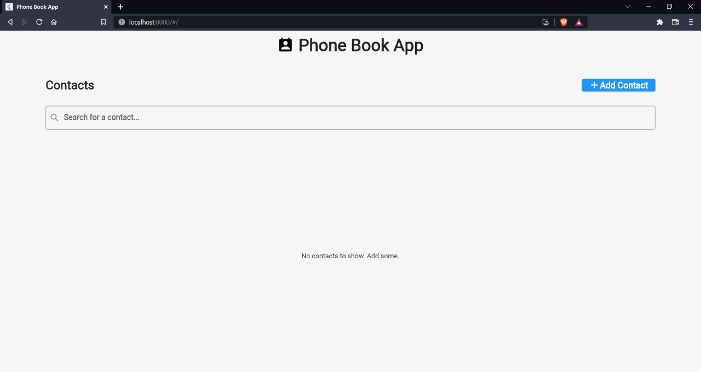
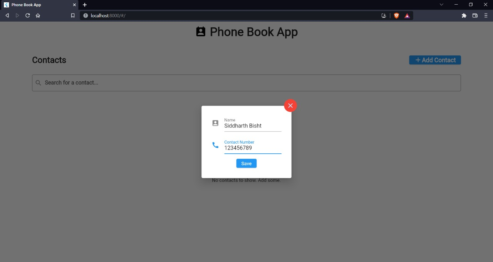
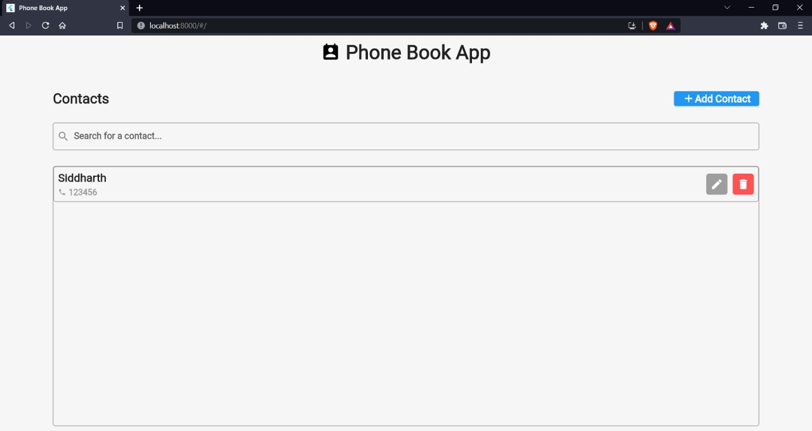

# Phone Book

Phone Book is a simple web application developed to test flutter web. It stores contact information and connects to a Flask backend.

## Screenshots

<p float = 'middle'>



</p>

## Steps to run the web app

Prerequisite - Python

1) Cd into backend and ```pip install requirements.txt```.
2) Run server using command ```python -u path_to_main.py```.
3) Cd into ```frontend/web/``` and use command ```python -m http.server``` to start the web app.
4) Use the app.
## License

[MIT](https://choosealicense.com/licenses/mit/)